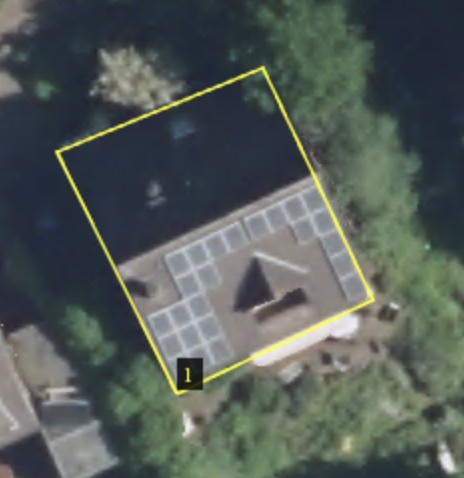

Solar-Panel-Detector 🛰️☀️
==============================

The original repository can be found in https://github.com/ArielDrabkin/Solar-Panel-Detector

## Overview

WIP

## Run

Refer to `Makefile`

## Input format

A folder with images and an overview CSV file:

```
images
├── buildings.csv
├── example_roof_solar_1.png
├── example_roof_solar_2.png
└── example_roof_solar_3.png
```

The overview file:

```
building_id,filename,building_geometry_wkt
0,example_roof_solar_1.png,"POLYGON ((93 204, 191 157, 136 41, 33 83, 93 204))"
1,example_roof_solar_2.png,"POLYGON ((93 204, 191 157, 136 41, 33 83, 93 204))"
2,example_roof_solar_3.png,"POLYGON ((93 204, 191 157, 136 41, 33 83, 93 204))"
```

The `building_geometry_wkt` is in pixel coordinates of the image.



The polygon (yellow) describes the building extent and is used to compare detections with the roof of the building.
